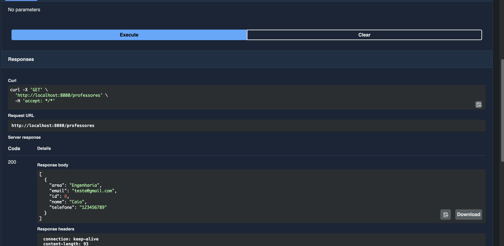
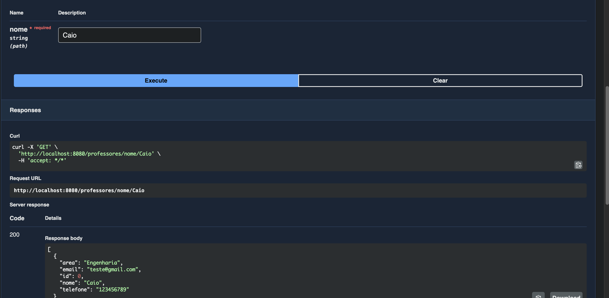
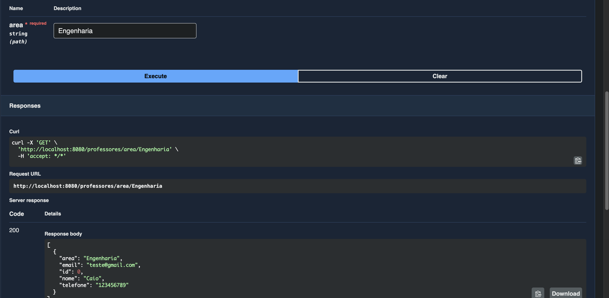
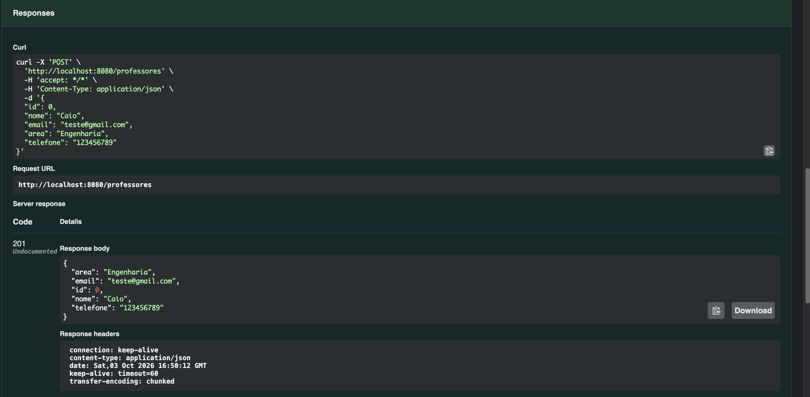
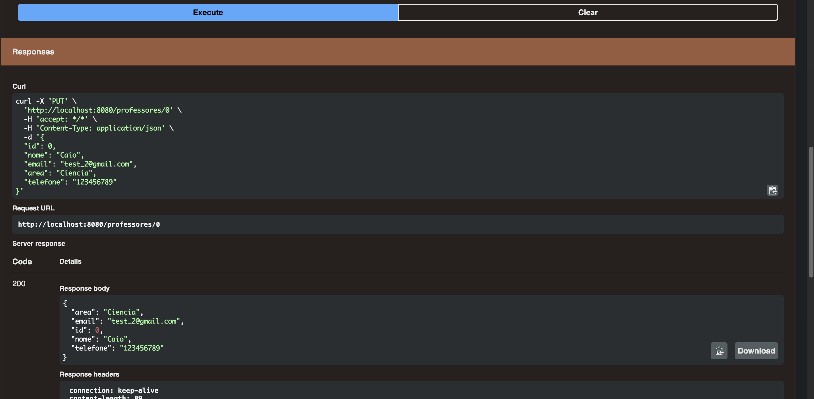
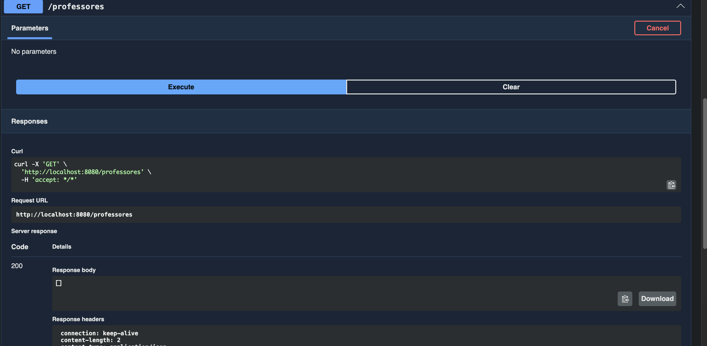

# API CRUD de Professores

## 7.1 Identificação

- **Aluno:** Caio
- **Disciplina:** Desenvolvimento Backend
- **Descrição:** API REST para gerenciamento de professores, permitindo cadastrar, listar, filtrar por nome ou área, editar e excluir registros em um banco de dados PostgreSQL.

## 7.2 Tecnologias utilizadas

- Java 25
- Spring Boot
- Spring Data JPA
- PostgreSQL
- Maven
- Docker (subida do banco de dados)
- Swagger / OpenAPI (documentação interativa)

## 7.3 Como executar

1. Suba o banco de dados PostgreSQL com Docker:

   ```bash
   docker compose up -d
   ```

2. Execute a aplicação:

   ```bash
   ./mvnw spring-boot:run
   ```

3. A API ficará disponível em `http://localhost:8080` e a documentação Swagger em `http://localhost:8080/swagger-ui.html`.

## 7.4 Endpoints

| Método | Endpoint | Descrição |
|---|---|---|
| GET | `/professores` | Lista todos os professores |
| GET | `/professores/nome/{nome}` | Filtra por nome |
| GET | `/professores/area/{area}` | Filtra por área |
| POST | `/professores` | Cadastra professor |
| PUT | `/professores/{id}` | Edita professor |
| DELETE | `/professores/{id}` | Exclui professor |

### Exemplo de corpo (POST/PUT)

```json
{
  "id": 1,
  "nome": "Ana Souza",
  "email": "ana@universidade.br",
  "area": "Matemática",
  "telefone": "1111-1111"
}
```

## 8. Evidências de execução

### Caso 1 — Listar professores

`GET /professores`



### Caso 2 — Filtrar por nome

`GET /professores/nome/{nome}`



### Caso 3 — Filtrar por área

`GET /professores/area/{area}`



### Caso 4 — Cadastrar professor

`POST /professores` com o JSON enviado e a resposta da API (status 201 Created).



### Caso 5 — Editar professor

`PUT /professores/{id}` com o resultado da alteração.



### Caso 6 — Excluir professor

`DELETE /professores/{id}` e o resultado da exclusão (status 204 No Content).



## Testes

Os testes dos endpoints foram escritos com MockMvc e estão em `src/test/java/professor/crud/demo/ProfessorControllerTest.java`. Para executar:

```bash
./mvnw test
```
